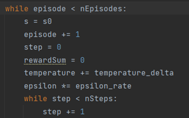
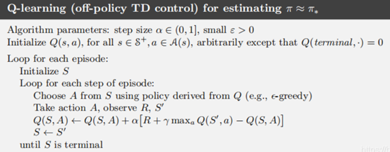
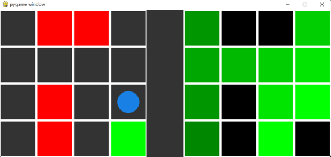

# **强化学习第三次作业**

# 第一部分 Q-learning算法

采用Q-learning算法实现与作业2相同的任务

## 1.1代码实现

Q_learning关键是维护一个q表

算法有两级循环，episode和step，其中的区别就是每个episode，智能体agent就需要回到 $s_0$ ：



## 1.1.1生成action

 遵从 $\epsilon-greedy$ 和Boltzmann exploration相结合的方式，如下：


随机数eps大于epsilon时，exploitation，利用Boltzmann exploration方式，也即对Q[s]取softmax归一化之后按概率取新的action


Boltzmann exploration: 即softmax，对于自己有把握的状态，就应该采取exploitation；而对于自己没有把握的状态，由于训练中的输赢不重要，所以可以多去尝试exploration，但同时也不是盲目地乱走，而是尝试一些自己认为或许还不错的走法。

同时，随着训练的进行，temperature越来越大（程序中是乘以temperature），也就越来越倾向于exploitation


随着训练的进行，epsilon越来越小，越来越倾向于exploitation

考虑到实验中采用了多种epsilon，采用类似于模拟退火的方式让epsilon累乘递减，而temperature则采用累加递增。

## 1.1.2生成(s,a,r,s')四元组

**第二步** 执行action，生成(s,a,r,s')四元组
 阅读了老师提供的函数代码sampleRewardAndNextState后，我加上了自己理解的注释：


然后使用这个函数生成四元组：


## 1.1.3 更新q表

**第三步**，更新q表

首先，对q表所要的nextState的q列表进行一个转换，提取出下一个state的各个a组成的一维列表


然后利用bellman方程更新q值：


## 1.1.4其他修改

最后，还有累加rewardlist，生成policy的方式如下：

Policy为每个state的最优action列表


## 1.2实验易错点

1. Boltzmann exploration过程中，计算softmax时我没有能够除以总和。

2. 贝尔曼方程更新时，新q值的计算引用了nextState的最大q值，而不是当前state的最大q值

3. Q表结构是先a后s，代码书写造成了一定困难。

## 1.3运行testRL.py


## 1.4运行testMaze.py

以下图像表示每个episode中每一step的累加reward

在学习率设置为0.01时：


在学习率设置为0.05时：


##        1.5 结果分析

学习率：可见一定范围内，学习率越大，模型训练速度越快学习率设置为0.05比0.01更优。

Epsilon：Epsilon越大，越倾向于exploration，而Epsilon越小则越倾向于exploitation。通过图像可知，epsilon越小，模型收敛速度越快。另外，由于我采用了temporature递增和epsilon递减的方式，所以后期基本完全为exploitation,因此各个epsilon下模型的收敛值也就基本相同。

对于本题的简单环境来说，无需太多的exporation即可找到最优解，但是exploration对于复杂环境下走出次优解，找到最优解，以及提升模型稳定性上有很重要的作用。

所以在训练前期保持较高的epsilon实际上也是有必要的，只是必要性在本题并不表现得很明显。

 

# 第二部分 迷宫导航

该部分任务是：分别使用q-learning和sarsa算法两个文件完成迷宫导航任务环境。

## 2.1算法原理

首先明确：Sarsa算法和q_learning算法的区别是：

q_learning算法是一种off-policy算法，Q-learning会先假设下一步选取最大奖赏的动作，然后更新值函数。

 



​      sarsa算法是一种on-policy算法，在每一步中，根据当前状态和选择的动作，计算奖励和下一个状态的Q值，并更新Q表。


 

## 2.2算法对比和代码实现

第一，二者选取action方式有不同，二者都通过  来选取action 但是sarsa算法执行在更新阶段之前选取的action，而q_learning在每个step最开始选定一个action。

第二，二者更新Q表的方式不同

Q-learning 更新规则

- 使用 **ϵ-greedy** 策略选择下一步动作 `a` 后到达 `next_state`
- 通过 `maxQ(s', a)` 来更新 `Q(s, a)`

SARSA更新规则

- 在 `next_state` 中使用 **ϵ-greedy** 生成动作 `a'`
- 使用 `Q(s', a')` 来更新 `Q(s, a)`
- 在下一步 **实际执行** 动作 `a'`

状态转移规则

- 当 `new_pos` **不是终止状态**时：
  - 执行动作到达新位置
- 当 `new_pos` 是终止状态时：
  - 不执行动作（因为Agent不能进入终止状态）

具体代码如下：

q_learning在使用  选择了下一步action后到了nextstate，选取max  来更新  。


 而  算法在nextstate中使用  来生成  ，使用  来更新  ，并且在下一步真的执行  。


其中，new_pos不是terminal的情况下，就执行action到达新的position，反之则不执行action，因为agent不能进入terminal

## 2.3结果和分析

q_learning训练结果：



sarsa训练结果：     


 

sarsa算法特点：第一，运动点更倾向于在收益高的地方徘徊，第二，sarsa上还出现了负收益的地方。这可能与q值更新时并不按照下一state的最高q值更新，所以有可能选择了下一state的负q值进行了更新，因此在  **ϵ-greedy**时，agent会更加避免接近障碍的地方。

收敛速度上，q-learning算法的q表收敛的速度更快，sarsa算法收敛的速度较慢，因为sarsa的随机性更强，也更加接近agent在真实的environment中探索的情况。

不过，sarsa算法可以很快在高收益和低收益地区收敛，并且轨迹很快稳定在高收益地区，而无需准确探明所有state的q值。

总之，q-learning算法在获得准确q值方面更有优势，而sarsa算法在以更低的犯错代价，快速探明高收益和低收益地区上更有优势。


# 第三部分Flappy bird游戏

训练DQN模型来玩Flappy bird游戏，我使用pytorch版本。该版本原本代码以iteration作为迭代变量进行迭代。

## 3.1文件说明

 

**注意，**训练好的模型，原版保存在pretrained_model2中，增加了targetNet的保存在pretrained_target中， 文件名称三参数含义：iteration，episode，保存当轮episode的reward


**但是为了不至于提交文件过大，我提交时仅仅保留了开头和最后几个pth**

代码修改：

1. 修改训练轮数iteration为120万次

2. 修改保存机制为每50个episode保存一次，而不以iteration为标准

## 3.2代码分析

首先，为了方便作图以及衡量训练效果，我增加了episode变量，每当reward<0即为终止一次，则episode加一。每个episode中产生的reward累加作为最后的rewardlist的元素。


## 3.3 targetNet版本的分析

增加targetNet的版本:

首先，主函数中，设置两个参数完全相同的net:targetNet和mainNet


然后，其中每次生成新的action时使用targetNet，然后产生的四元组  存入经验池buffer中，供mainNet进行参数更新

只需要修改两处：生成output的模型改为目标网络


 最后，targetNet每隔一段时间复制mainNet的参数：


 

## 3.4易错点


 易错点：但是我一开始还修改了后面的q值获取部分的model，，但是其实这里的batch_output是main网络进行更新的步骤，所以修改model只需上面所述一处


## 3.5训练结果

我设置每隔250轮更新一次targetNet，设置iteration=1200000次，训练结果：

原始版本，无targetNet版本：


 增加targetNet的版本：


对比图像发现三点：

- 第一，在相同的iteration下，targetNet版本的episode更多，这说明了targetNet版本的平均reward低于原始版本DQN，训练速度更慢；
- 第二，最终训练结束的reward，targetNet版本低于原始版本DQN；
- 第三，targetNet版本的reward曲线更加平稳，reward方差更小，说明模型训练的更加稳定。

TargetNet用于解决DQN算法中的延迟更新问题。通过使用Target Network，可以在训练过程中定期延迟更新目标网络的权重，使其更接近当前网络的权重。这样可以避免由于网络更新过快而导致的不稳定现象，从而提高模型的性能。

# 第四部分 gym环境的强化学习

使用DQN的神经网络在简单任务上进行训练，并推理玩Atari的Pong游戏。

## 4.1环境和配套代码报错

第一：安装环境过程中，可以完全按照乐学上的步骤安装gym和atari，

第二：安装ffmpeg需要执行命令conda install -c conda-forge ffmpeg

第三：跨文件夹import的错误：以下代码报错：from core.q_learning import QN

只需要从项目文件夹开始的目录，写全路径即可解决：from RL.DQN_Pong.core.q_learning import QN

第四：我的numpy版本不能写np.bool，要写np.bool_

第五，boolean变量不能用减号计算(1-done_mask),而应该采用(~done_mask)

## 4.2网络代码补全

编写网络代码。网络架构一开始我按照自己的想法构建，但是出现了网络不匹配的报错。

实际上代码框架为：


代码的框架与part3的DQN相同，输入为通道数乘batch数，然后out_channels,stride,kernel_size按照既定常数，padding按照公式

 ```
padding=((stride - 1) * img_height - stride + filter_size) // 2
 ```

计算，保证最后输出图像的长宽保持不变。最后两层全连接层，输入参数为经过flatten的一维张量长度` n_channels * 64 * img_height * img_width`  ，输出维度为可选动作数num_actions。

## 4.3损失函数代码

损失函数计算：Q_samp(s)表示采样得到的Q值，r表示实际获得的奖励，gamma表示折扣因子，max_a'表示目标网络在状态s'下选择的最大动作Q_target(s', a')，done表示是否到达终止状态。

首先将动作转换为one-hot编码，然后计算采样得到的Q值Q_samp。接着，使用均方误差损失函数计算损失。最后，返回计算得到的损失值。


## 4.4训练任务

任务一：训练过程：直接运行q6_nature_torch.py

训练过程如下：     


训练结果：


## 4.5推理任务

任务二：推理任务，玩Atari的Pong游戏。

​     

 载入5score.weights，推理Pong游戏，得出最优结果为test3


最后附上我对于项目四的代码框架理解：

- Utils文件夹下是其他代码中需要使用的一些方法、函数。
- Core文件夹中存储的是q_learning的一些核心的方法
- Configs中分别记录了训练任务和推理任务需要用到的超参数，文件名也对应q6和q7。
- Weight文件夹下是训练好的用于推理任务的网络权重。
- q6用于训练简单的任务，q7用于载入预训练的weights进行推理。

**我的感想：**

这次的作业对我来说有不小的难度，在代码书写中，需要配合已有的代码。这要求阅读清楚提供的代码的含义。在第四个项目中，我更是花了不少的时间搞懂项目的框架。在实验中我有许多报错，然后试图修改已有的代码，但是改到最后还是都改回去了，说明老师和学长学姐提供的代码鲁棒性还不错。我觉得这种补全代码的形式既可以锻炼我的工程能力，又可以让我专注于关键的知识点，节省搭建工程的时间，我觉得这是一种多快好省的作业形式。